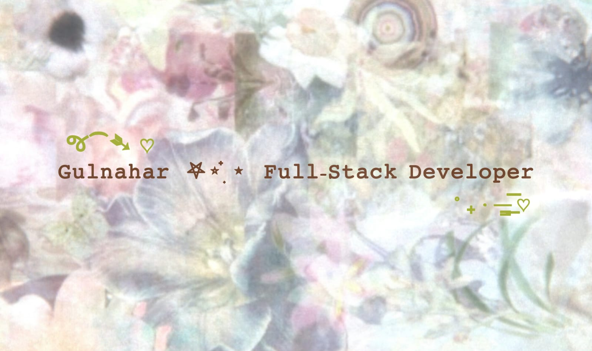

  

  

 

  
    
  
  
  
  

    Hi, I'm <b>Mst. Gulnahar</b> — a full-stack developer blending <i>robust backend logic</i> with <i>storybook-inspired aesthetics</i>. I build digital spaces that feel <b>intentional and cozy</b>.
  

  

    
    
    
  

 

  <h2 style="color: #2D5A27;">🌿 My Technical Garden 🌿</h2>
  

 

  <h3 style="color: #B5835A;">✧ Current Focus ✧</h3>
  
  
  

     🌸 <b>Next.js</b> — Exploring Scalable Architecture  
     📜 <b>The Archive</b> — Crafting Digital Lore  
     ✨ <b>Creative Coding</b> — Perfecting Smooth UI 
  

 

  <h3 style="color: #B5835A;">✧ Get In Touch ✧</h3>
  
  
  

 

  

